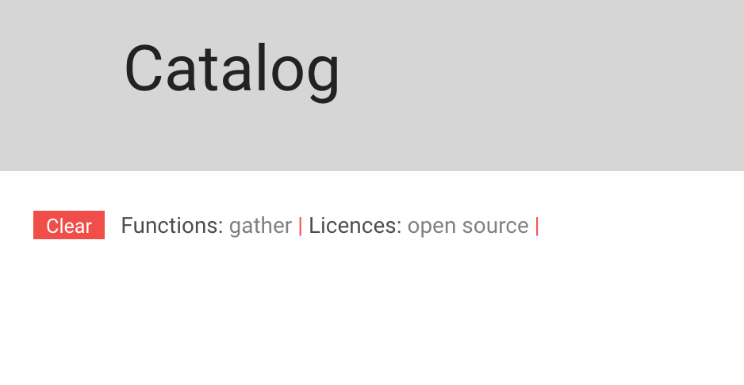

# Data Resources Portal (DRP) Documentation
### Website URL: https://www.northeastern.edu/dataresources/


#### Website description
DRP is a Northeastern website that collects information about available software related to the data science ecosystem. It is primarly aimed at faculty and students conducting any data-driven project with little or no knowledge in the field. The main sections of the website are:

Section | Description
------------ | -------------
Catalog | Searchable and filterable catalog that aggregates all the known data science software offered by NEU.
Resources | Contains information about Authors, tutorials, faculty and other experts that can help faculty and students learn more about data science or provide guidance on specific projects.
Learn | **Future goal** This section will contain curated information to get started on a series of data science topics.
Community | **Future goal** THis section will contain a forum where students and faculty can collaborate, post projects, questions or ideas.

<br>

#### 1. Basic How-Tos

##### 1.1 Adding new tools:
To add a new tool simply create a new post. :fire: Make sure to set the category to **"tool"**. If you don't do this the new tool will not show up in the catalog


:fire: Make sure you fill out all the fields. First fill in the main fields:


Field| Description
------------ | -------------
Title | The name of the tool (e.g. Wolfram Mathematica)
Summary | The short text that will appear in the catalog view at `dataresources/catalog`
Tool link | The link to where the tool can be downloaded at Northeastern or a provider's website
Resources | A list of additional resources. :fire: Add each resource as one line of plain text, then use the hyperlink button. Make sure to select "open link in a new tab" under the options (cog wheel) icon
Post body | The longer description of the tool that will be read on the tool's page, for example at `dataresources/mathematica`

<br>

Then on the right panel, you'll find these fields:

Field| Description
------------ | -------------
Categories | :fire: Make sure to set the category to "tool". If you don't do this the new tool will not show up in the catalog
Tags | Add tags separated by comma (e.g. `tag1,tag2`) or select from the options while you type. Avoid the duplication of tags (i.e. if 'stats' already exists, use it instead of adding 'statistics')
Functions | Check as many as apply. These are the main functions of a tool
Licences | Check as many as apply
Coding skills required | Check only one
OS | Check as many as apply
Platform | Check as many as apply
Featured image | Add an image of at least 200x200px. It's better if the image is cropped in a square proportion

<br>

##### 1.2 Adding new resources:
To add a new resource simply create a new post. :fire: Make sure to set the category to **"resource"**. If you don't do this the new tool will not show up in the catalog


:fire: Make sure you fill out all the fields. First fill in the main fields:


<br>

#### 2. Implementation & plugins

##### 2.1 Wordpress and the main theme:
A custom theme was developed based on the [Advance WP Theme](http://advance.imonthemes.com/). This theme was found to be very well suited for the proposed layout of the website. To prevent additional updates of the theme that could delete any customization, a clone of this theme was created, called *AdvanceCustom*, which is where all the custom files are located.

##### 2.2 Page build up:
The plugin [visual composer](https://vc.wpbakery.com/) is used to build a lot of the simpler components of the website, some pages however, like the homepage or the catalog page required more custom code. In particular, the tool view (i.e. the page that displays information about a given tool) had to be custom created using PHP, in order to accomodate all the custom data and more complex layout. This file can be found in `./content-single.php`.

##### 2.3 Custom Fields plugin:
Custom fields allow the creation of data fields that can contain almost any type of data. They're used in DRP to add all sorts of custom content to the post, so that a given tool can have extra attributes e.g. "summary or link to the tool". This in turn allows these fields to be filterable and searchable.

[Advanced Custom Fields](https://srd.wordpress.org/plugins/advanced-custom-fields/) was installed in order to make the creation of custom fields easier and code-free. To manage the custom fields go to `Custom Fields` on the Dashboard sidebar. Additionally, a plugin called [ACF-VC](https://srd.wordpress.org/plugins/acf-vc-integrator/) is used so that these fields are accessible by Visual Composer, and to build page elements with them. See diagram.


##### 2.4 Search and Filter Pro:
[The Search and Filter Pro plugin](https://www.designsandcode.com/wordpress-plugins/search-filter-pro/) enables the functionality of the catalog. This filter searches taxonomies and text inside each post, and can be fully customized to include only certain taxonomies if desired.

##### 2.5 Scripts n Styles Plugin:
[The Scripts n Styles plugin](https://wordpress.org/plugins/scripts-n-styles/) allows to inject custom Javascript and other libraries into a specific page. This is used in two pages: Homepage (3.1) and Catalog (3.2).

##### 2.6 Related posts:
The [Yuzo Related Posts Plugin](https://rup.wordpress.org/plugins/yuzo-related-post/) function is self explanatory. It allows the creation of a "related posts" section in every tool page. This is currently set to find related posts based on **tags**. There is also **custom** css applied within the tool settings.

##### 2.7 Taxonomies:
There's two plugins that allow to manage taxonomies. [MW Taxonomy](http://matswestholm.se/en/wordpress-plugin/mw-taxonomy/) allows to create new taxonomies without code. To access this plugin, go to `Taxonomy` on the left panel of the dashboard.

Additionally, [Custom Taxonomy Order NE](https://rup.wordpress.org/plugins/custom-taxonomy-order-ne/) allows to change the order of the taxonomies for a better hierarchical organization. To access the setting of the pluging, go to `Term Order` on the left panel of the dashboard.

<br>

#### 3. Pages specs

###### 3.1 The homepage:
The homepage was build with a custom php template, a custom "hero image" with a particle system and visual composer for the rest of the contents.

* 3.1.1 Custom php template: A simplification of the `page.php` template that removes the grey header. The file is `page-home.php`. This file shouldn't usually be modified.

* 3.1.2 Hero image: To acomplish the layout of the "hero image", the library [particle.js](http://vincentgarreau.com/particles.js/) was implemented. The particle.js library works using two files: the library file `particle.js` and the configuration file `grab-particles-config.json`. The `particle.js` file can be found at: `https://www.northeastern.edu/dataresources/wp-content/themes/advanceCustom/js/particles.js`. This file is read in using the Script n Styles plugin in the homepage, using the following code:

```
document.addEventListener('DOMContentLoaded', function() {
  particlesJS.load('particles-js', 'https://www.northeastern.edu/dataresources/wp-content/themes/advanceCustom/js/grab-particles-config.json', function() {
  console.log('callback - particles.js config loaded');
  });
}, false);
```

Note the location of the config file.


Additionally, you can find a **Raw HTML** VC element that contains a `div` with `id = "particles-js"`. This element is where the particles are drawn.

* 3.1.3 Custom CSS: Found under the page CSS within the visual composer editing view (cog icon on top right corner). The custom css uses **Flexbox** to neatly arrange the elements. Some additional was added for the appearance of the two main buttons.


###### 3.2 The Catalog page:

* 3.2.1 There's two filters created using the Search & Filter plugin. One filter is for desktop view (`searchandfilter[data-sf-form-id="296"]`) and the other one is for mobile view (`.searchandfilter[data-sf-form-id="437"]`). Specific CSS was added to customize the look and feel of these filters. (See section **3**)

* 3.2.2 The grid is populated with posts with all posts that have the `Category = Tool`.

* 3.2.3 The overal layout is constructed using visual composer, using a custom grid called **Custom Catalog page**. However, there's a **Raw HTML** VC component that injects a "breadcrumb" element to indicate to the user that he's currently filtering tools. This HTML is injected via a script included in the Catalog Page using the Scripts n Styles plugin.



<br>

##### 4. Custom CSS:

Custom CSS was required for the look and feel and the responsiveness of the website. There are several locations with custom CSS:
- General custom CSS: found in `styles.css`
- Plugin-specific custom CSS: found inside the menu of Visual Composer and Related Posts
- Page-specific custom CSS: found in some specific pages under the cog wheel in visual composer edit mode (see **section 3**).

<br>

##### 4. Styles guide:

###### 4.1 Colors:

The main colors are:
- DRP Orange: [#F14E49](http://www.colorhexa.com/f14e49)
- DRP Purple: [#3A2B4A](http://www.colorhexa.com/3a2b4a)
- Main grey: [#555555](http://www.colorhexa.com/555555)
- Light grey: [#95989A](http://www.colorhexa.com/95989a)
- Text: [#555555](http://www.colorhexa.com/555555)


###### 4.2 Fonts:

The website uses [Roboto](https://fonts.google.com/specimen/Roboto). Specifically the 400 (regular) and 300 (light) weights.

